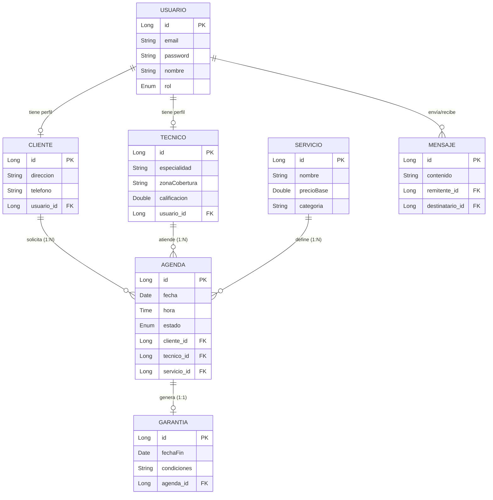

```mermaid
erDiagram
    USUARIO {
        Long id PK
        String email
        String password
        String nombre
        Enum rol
    }

    CLIENTE {
        Long id PK
        String direccion
        String telefono
        Long usuario_id FK
    }

    TECNICO {
        Long id PK
        String especialidad
        String zonaCobertura
        Double calificacion
        Long usuario_id FK
    }

    SERVICIO {
        Long id PK
        String nombre
        Double precioBase
        String categoria
    }

    AGENDA {
        Long id PK
        Date fecha
        Time hora
        Enum estado
        Long cliente_id FK
        Long tecnico_id FK
        Long servicio_id FK
    }

    GARANTIA {
        Long id PK
        Date fechaFin
        String condiciones
        Long agenda_id FK
    }

    MENSAJE {
        Long id PK
        String contenido
        Long remitente_id FK
        Long destinatario_id FK
    }

    %% Relaciones de Identidad (1 a 1 estricto)
    USUARIO ||--o| CLIENTE : "tiene perfil"
    USUARIO ||--o| TECNICO : "tiene perfil"

    %% Relaciones de la Agenda (El NÚCLEO)
    CLIENTE ||--o{ AGENDA : "solicita (1:N)"
    TECNICO ||--o{ AGENDA : "atiende (1:N)"
    SERVICIO ||--o{ AGENDA : "define (1:N)"

    %% Relación de Resultado (1 a 1)
    AGENDA ||--o| GARANTIA : "genera (1:1)"

    %% Relaciones de Chat
    USUARIO ||--o{ MENSAJE : "envía/recibe"
```
